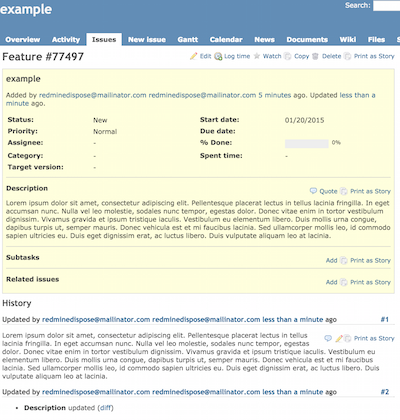
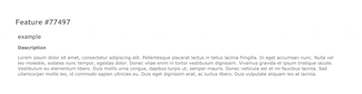

# Redmine Issue Printing

Super simple [http://tampermonkey.net/](http://tampermonkey.net/) script to format and print a redmine issue without the surrounding redmine elements.

## What?

A full blown issue can easily be printed without the redmine layout.

Example issue:

  

When beeing printed:

Besides adding a few simple css styles for the print layout, the scripts adds a "Print as Story" to the issue submenu:

## Installing

1. Install the [Tampermonkey](http://tampermonkey.net/) extension
2. Follow this [link](https://github.com/rebuy-de/redmine-print-issue/raw/master/RedminePrintIssue.user.js) to install the script
